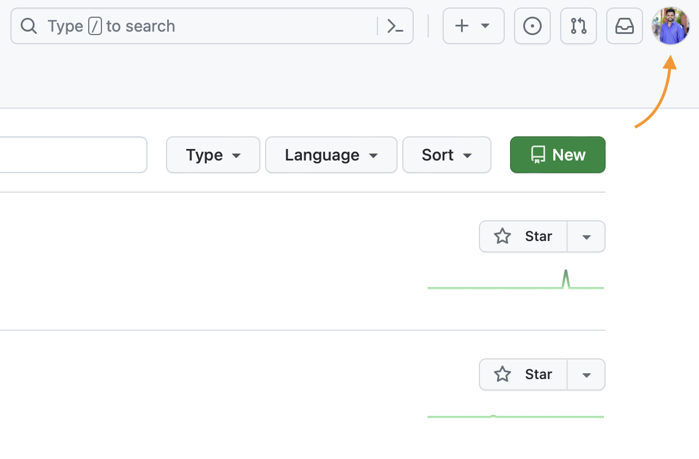

# Setting Up Your GitHub Account

This guide will walk you through the essential steps to set up your GitHub account for a smooth and secure experience.

## 1. Sign Up for GitHub

If you don't have a GitHub account yet, go to [GitHub's sign-up page](https://github.com/join) and follow the instructions to create an account.

## 2. Profile Setup

### a. Profile Picture

1. Click on your profile icon in the top-right corner.
2. Select "Settings."
3. In the left sidebar, click on "Profile."
4. Under the "Profile picture" section, click "Upload a picture" and follow the prompts to set your profile picture. Choose a clear and professional image.

   

### b. Real Name

1. In the "Profile" section (as mentioned above), you can also set your real name. This helps other users recognize you more easily.

   

## 3. Two-Factor Authentication (2FA)

Setting up Two-Factor Authentication adds an extra layer of security to your GitHub account.

1. In the "Settings" page, click on "Security" in the left sidebar.
2. Under the "Two-factor authentication" section, click "Set up two-factor authentication."
3. Follow the prompts to complete the setup. You can choose between using an authentication app or SMS.

## 4. Public Email

Adding a public email allows other users to contact you.

1. In the "Profile" section (as mentioned above), you can set your public email. It can be your primary email or a dedicated email for GitHub.

## 5. Customize Your Profile

You can further customize your profile by adding a bio, location, and other details. This helps others learn more about you and your interests.

## 6. Explore GitHub

Now that your account is set up, you can start exploring GitHub, discovering repositories, contributing to projects, and collaborating with other developers.

Remember to review GitHub's [Terms of Service](https://docs.github.com/en/github/site-policy/github-terms-of-service) and [Community Guidelines](https://docs.github.com/en/github/site-policy/github-community-guidelines) to ensure you're using the platform appropriately.

Happy coding!